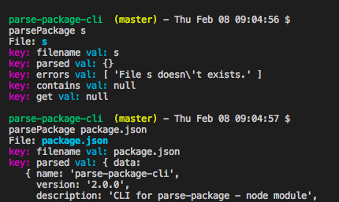

# parse-package-cli

CLI for parse-package - node module

Command: `parsePackage`



## Usage

```bash

  # setup node and npm env
  nvm install node    # install latest node version
  nvm use node        # use latest node version
  npm i -g npm        # install latest npm

  npm i -g parse-package-cli # install cli tool for parsing package globally
  npm i -g commander # will fix it soon.

  parsePackage filename
  # returns output

```

### Success case

```bash

  parsePackage s
  File: s
  key: filename val: s
  key: parsed val: {}
  key: errors val: [ 'File s doesn\'t exists.' ]
  key: contains val: null
  key: get val: null

  parse-package-cli  (master) - Thu Feb 08 09:04:57 $
  parsePackage package.json
  File: package.json
  key: filename val: package.json
  key: parsed val: { data:
    { name: 'parse-package-cli',
      version: '2.0.0',
      description: 'CLI for parse-package - node module',
      main: 'src/index.js',
      scripts: { test: 'jasmine' },
      repository:
        { type: 'git',
          url: 'git+https://github.com/anusaini/parse-package-cli.git' },
      keywords: [ 'cli', 'parse package', 'parse package cli' ],
      author: 'Blunt <anusaini@paypal.com>',
      license: 'MIT',
      bugs: { url: 'https://github.com/anusaini/parse-package-cli/issues' },
      homepage: 'https://github.com/anusaini/parse-package-cli#readme',
      devDependencies:
        { chai: '^4.1.2',
          eslint: '^4.17.0',
          'eslint-config-standard': '^11.0.0-beta.0',
          'eslint-plugin-import': '^2.8.0',
          'eslint-plugin-node': '^6.0.0',
          'eslint-plugin-promise': '^3.6.0',
          'eslint-plugin-standard': '^3.0.1',
          jasmine: '^3.0.0' },
      dependencies:
        { chalk: '^2.3.0',
          commander: '^2.14.1',
          'parse-package': '^3.0.0' },
      bin: { parsePackage: 'src/index.js' } },
    flattenedKeys:
    [ 'name',
      'version',
      'description',
      'main',
      'scripts.test',
      'repository.type',
      'repository.url',
      'keywords.0',
      'keywords.1',
      'keywords.2',
      'author',
      'license',
      'bugs.url',
      'homepage',
      'devDependencies.chai',
      'devDependencies.eslint',
      'devDependencies.eslint-config-standard',
      'devDependencies.eslint-plugin-import',
      'devDependencies.eslint-plugin-node',
      'devDependencies.eslint-plugin-promise',
      'devDependencies.eslint-plugin-standard',
      'devDependencies.jasmine',
      'dependencies.chalk',
      'dependencies.commander',
      'dependencies.parse-package',
      'bin.parsePackage' ],
    flattenedValues:
    [ { key: 'name', val: 'parse-package-cli' },
      { key: 'version', val: '2.0.0' },
      { key: 'description',
        val: 'CLI for parse-package - node module' },
      { key: 'main', val: 'src/index.js' },
      { key: 'scripts.test', val: 'jasmine' },
      { key: 'repository.type', val: 'git' },
      { key: 'repository.url',
        val: 'git+https://github.com/anusaini/parse-package-cli.git' },
      { key: 'keywords.0', val: 'cli' },
      { key: 'keywords.1', val: 'parse package' },
      { key: 'keywords.2', val: 'parse package cli' },
      { key: 'author', val: 'Blunt <anusaini@paypal.com>' },
      { key: 'license', val: 'MIT' },
      { key: 'bugs.url',
        val: 'https://github.com/anusaini/parse-package-cli/issues' },
      { key: 'homepage',
        val: 'https://github.com/anusaini/parse-package-cli#readme' },
      { key: 'devDependencies.chai', val: '^4.1.2' },
      { key: 'devDependencies.eslint', val: '^4.17.0' },
      { key: 'devDependencies.eslint-config-standard',
        val: '^11.0.0-beta.0' },
      { key: 'devDependencies.eslint-plugin-import', val: '^2.8.0' },
      { key: 'devDependencies.eslint-plugin-node', val: '^6.0.0' },
      { key: 'devDependencies.eslint-plugin-promise', val: '^3.6.0' },
      { key: 'devDependencies.eslint-plugin-standard', val: '^3.0.1' },
      { key: 'devDependencies.jasmine', val: '^3.0.0' },
      { key: 'dependencies.chalk', val: '^2.3.0' },
      { key: 'dependencies.commander', val: '^2.14.1' },
      { key: 'dependencies.parse-package', val: '^3.0.0' },
      { key: 'bin.parsePackage', val: 'src/index.js' } ],
    keys:
    [ 'name',
      'version',
      'description',
      'main',
      'scripts',
      'repository',
      'keywords',
      'author',
      'license',
      'bugs',
      'homepage',
      'devDependencies',
      'dependencies',
      'bin' ] }
  key: errors val: []
  key: contains val: function (keys) {
              return truekeys(parsed, keys)
          }
  key: get val: function (keys) {
              return out.contains(keys) ? keys.map(k => { return { key: k, val: out.parsed.data[k] } }) : []
          }

```

### Failing case

```bash

  parsePackage s
  File: s
  key: filename val: s
  key: parsed val: {}
  key: errors val: [ 'File s doesn\'t exists.' ]
  key: contains val: null
  key: get val: null

```

## License

MIT 2018
